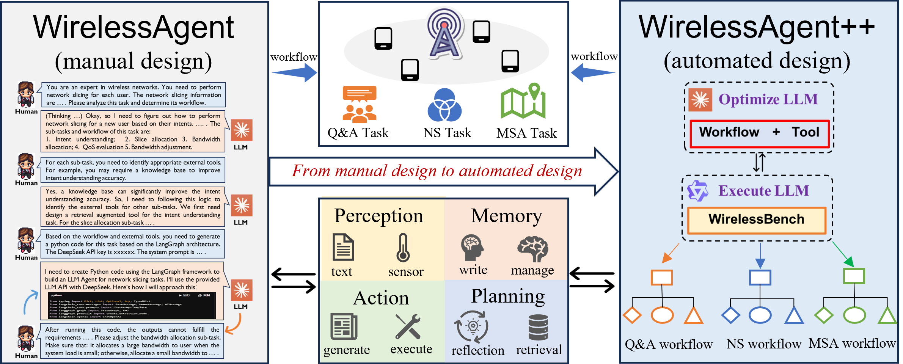
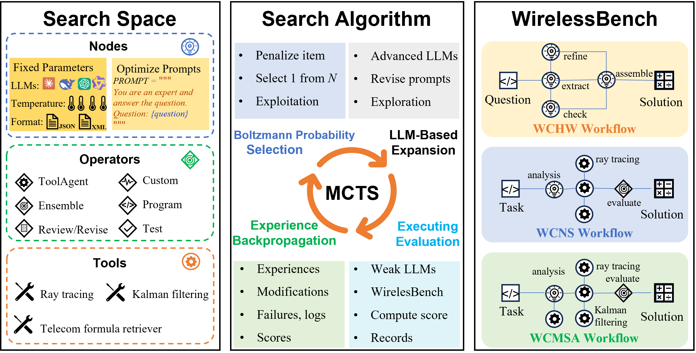
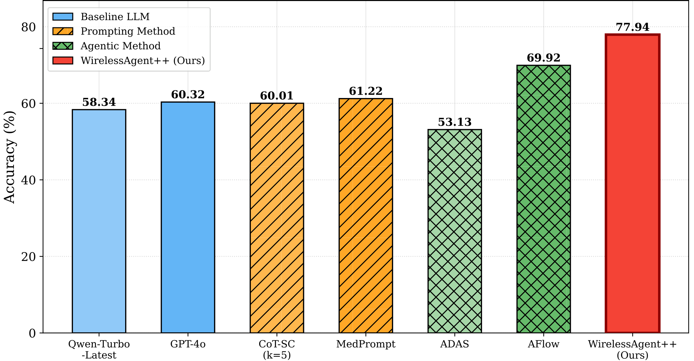
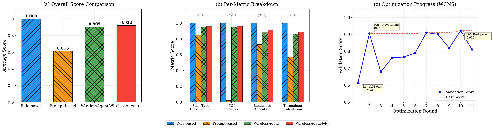
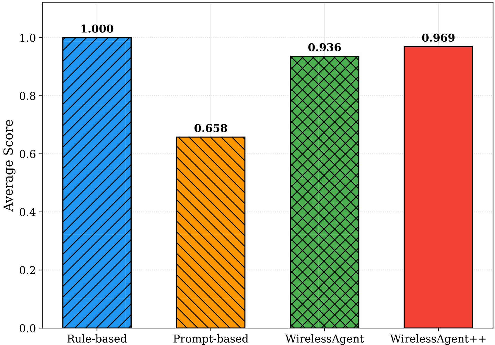

<p align="center">
  
</p>

<h1 align="center">WirelessAgent++</h1>
<h3 align="center">Automated Agentic Workflow Design and Benchmarking for Wireless Networks</h3>

<p align="center">
  <a href="https://arxiv.org/abs/xxxx.xxxxx"></a>
  <a href="#wirelessbench"></a>
  <a href="LICENSE"></a>
  <a href="https://github.com/jwentong/WirelessAgent-R2/issues"></a>
  <a href="https://github.com/jwentong/WirelessAgent-R2/pulls"></a>
</p>

<p align="center">
  <b>WirelessAgent++</b> automates the design of LLM-based autonomous agents for wireless network tasks.<br>
  It casts agent design as a <i>program search problem</i> and solves it with domain-adapted <b>Monte Carlo Tree Search (MCTS)</b>,<br>
  autonomously discovering workflows that outperform hand-crafted baselines by up to <b>31%</b>.
</p>

---

## 📋 Table of Contents

- [Highlights](#-highlights)
- [System Overview](#-system-overview)
- [MCTS Optimization](#-mcts-optimization)
- [WirelessBench](#-wirelessbench)
- [Results](#-results)
- [Quick Start](#-quick-start)
- [Project Structure](#-project-structure)
- [Citation](#-citation)
- [Acknowledgments](#-acknowledgments)

---

## ✨ Highlights

| | |
|---|---|
| 🔄 **Automated Agent Design** | No manual workflow engineering — MCTS automatically discovers optimal operator compositions, prompt strategies, and tool-calling patterns |
| 🛠️ **Domain-Specific Tool Integration** | ReAct-based `ToolAgent` and deterministic `CodeLevel` operators seamlessly integrate ray-tracing predictors, Kalman filters, and telecom calculators |
| 📊 **WirelessBench Suite** | 3,392 problems across 3 dimensions: knowledge reasoning (WCHW), network slicing (WCNS), and mobile service assurance (WCMSA) |
| 💰 **Ultra-Low Cost** | Full optimization search costs **< \$5** per task; per-problem inference costs **< \$0.001** |
| 🏆 **State-of-the-Art** | Outperforms prompting baselines by up to **31 pp** and general-purpose workflow optimizers by **11.9 pp** |

---

## 🏗️ System Overview

<p align="center">
  
</p>

**Left:** In WirelessAgent, a human expert iteratively designs a fixed agentic workflow through multi-round dialogue with an LLM.  
**Right:** In WirelessAgent++, an **Optimizer LLM** (Claude-Opus-4.5) jointly searches over workflow structures and tool-calling strategies via MCTS; the resulting workflow is executed by an **Executor LLM** (Qwen-turbo-latest) on WirelessBench, automatically producing distinct, task-adaptive workflows without manual engineering.

### Key Operators

| Operator | Description |
|----------|-------------|
| `Custom(x, p)` | Invokes an LLM with input `x` and instruction prompt `p` |
| `ToolAgent(x, s)` | ReAct-based agent that interleaves reasoning and tool calls for up to `s` iterations |
| `CodeLevel(x, f)` | **LLM-free** deterministic tool execution — zero variance, near-zero cost |
| `ScEnsemble({yᵢ}, x)` | Self-consistency voting across multiple candidate answers |
| `AnswerGenerate(x)` | Structured final answer production |

> 💡 **Key Finding:** The MCTS optimizer autonomously discovers that `ToolAgent`-based workflows can be *compiled* into more efficient `CodeLevel` pipelines, effectively removing the LLM from the tool-calling path while maintaining accuracy.

---

## 🌲 MCTS Optimization

<p align="center">
  
</p>

WirelessAgent++ employs three domain-aware enhancements to the standard MCTS algorithm:

1. **Penalized Boltzmann Selection** — Prevents the optimizer from being trapped in poorly performing subtrees by applying a temperature-controlled penalty to already-visited nodes.

2. **Maturity-Aware Heuristic Critic** — A lightweight LLM pre-screens proposed mutations before expensive evaluation, filtering out obviously poor candidates.

3. **3-Class Experience Replay** — Classifies mutation outcomes as *Success*, *Neutral*, or *Failure* (rather than binary), preventing noise-induced fluctuations from corrupting the experience buffer.

### Optimization Results

- **19 rounds** of optimization, **\$4.95** total search cost, **~63 min** wall-clock time
- Score improved from **62.44%** (Round 1, seed) to **81.78%** (Round 14, best)  — a **+30.97%** improvement
- The optimizer discovers tool integration (Round 2, +18.42 pp) as the single largest gain

---

## 🏆 WirelessBench

WirelessBench is a standardized, multi-dimensional benchmark suite for evaluating LLM agents on wireless communication tasks:

| Benchmark | Problems | Val / Test | Task Type | Key Challenge |
|-----------|----------|------------|-----------|---------------|
| **WCHW** | 1,392 | 348 / 1,044 | Knowledge Reasoning | Multi-step formula application, unit conversion |
| **WCNS** | 1,000 | 250 / 750 | Code + Tool Use | Ray-tracing CQI prediction → bandwidth allocation |
| **WCMSA** | 1,000 | 250 / 750 | Multi-Step Decision | Kalman prediction → CQI estimation → QoS assurance |

### Data Construction Pipeline

1. **Data Collection** — Seed problems from wireless textbooks (Goldsmith, Molisch) and 3GPP/IEEE standards
2. **Psychometric Data Cleaning** — 10-LLM funnel pipeline with item-total correlation, Mokken scale analysis, and inter-item consistency
3. **LLM-Based Augmentation** — Parameter variation, bidirectional conversion, cross-topic integration (LLMs generate problem text only; all ground truths computed by deterministic solvers)
4. **Human Validation** — Graduate-student verification of every problem

### Workflow Evolution Examples

**WCNS (Network Slicing) — 3-Phase Trajectory:**
- **Phase 1 — Seed** (61.3%): Bare LLM call, CQI prediction essentially random
- **Phase 2 — Tool Discovery** (90.5%, +29.2 pp): `ToolAgent` discovers ray-tracing tool
- **Phase 3 — Tool Compilation** (92.18%, +1.7 pp): `ToolAgent` → `CodeLevelRayTracing` (deterministic, LLM-free)

**WCMSA (Mobile Service Assurance) — 3-Phase Trajectory:**
- **Phase 1 — Seed** (65.76%): No position prediction or channel estimation
- **Phase 2 — Multi-Tool Discovery** (93.59%, +27.83 pp): `ToolAgent` chains Kalman filter → ray-tracing
- **Phase 3 — Tool Compilation** (96.89%, +1.35 pp): Compiled into `CodeLevelKalmanPredictor` → `CodeLevelRayTracing`

---

## 📈 Results

### WCHW — Wireless Communication Homework

<p align="center">
  
</p>

### WCNS — Wireless Communication Network Slicing

<p align="center">
  
</p>

### WCMSA — Mobile Service Assurance

<p align="center">
  
</p>

### Main Results

| Method | HotpotQA (F1) | DROP (F1) | MATH (Acc) | WirelessBench |
|--------|:---:|:---:|:---:|:---:|
| Qwen-turbo (Zero-shot) | 0.3754 | 0.5764 | 0.7550 | 0.5244 |
| CoT | 0.5261 | 0.5893 | 0.7737 | 0.5244 |
| MedPrompt | 0.5099 | 0.6031 | 0.6833 | 0.5244 |
| ADAS | 0.6108 | 0.6102 | 0.7697 | 0.5244 |
| AFlow | 0.6818 | 0.7788 | 0.8103 | 0.6992 |
| **WirelessAgent++** | **0.7273** | **0.8021** | **0.8210** | **0.8102** |

### Search Cost

| | WCHW | WCNS | WCMSA |
|---|:---:|:---:|:---:|
| Search Rounds | 19 | 11 | 11 |
| Wall-Clock Time | 63 min | 13 min | 14 min |
| Total Search Cost | $4.95 | $0.99 | $1.05 |
| Per-Problem Inference | $0.00083 | $0.00056 | $0.00068 |

---

## 🚀 Quick Start

### 1. Environment Setup

```bash
# Clone the repository
git clone https://github.com/jwentong/WirelessAgent-R2.git
cd WirelessAgent-R2

# Create conda environment
conda create -n wirelessagent python=3.9
conda activate wirelessagent

# Install dependencies
pip install -r requirements.txt
```

### 2. Configure API Keys

Copy the example config and fill in your API keys:

```bash
cp config/config2.example.yaml config/config2.yaml
```

Edit `config/config2.yaml` with your LLM API credentials:

```yaml
models:
  "Claude-Opus-4.5":
    api_type: "openai"
    base_url: "<your_base_url>"
    api_key: "<your_api_key>"
    temperature: 0
  "qwen-turbo-latest":
    api_type: "openai"
    base_url: "https://dashscope.aliyuncs.com/compatible-mode/v1"
    api_key: "<your_api_key>"
    temperature: 0
```

### 3. Download Datasets

```bash
python data/download_data.py
```

### 4. Run Optimization

```bash
# Run on WirelessBench benchmarks
python run.py --dataset WCHW --max_rounds 20
python run.py --dataset WCNS --max_rounds 15
python run.py --dataset WCMSA --max_rounds 15

# Run on general NLP benchmarks
python run.py --dataset MATH --max_rounds 20
python run.py --dataset HotpotQA --max_rounds 20
```

### Command-Line Arguments

| Argument | Default | Description |
|----------|---------|-------------|
| `--dataset` | *(required)* | Benchmark name (WCHW / WCNS / WCMSA / MATH / HotpotQA / DROP / ...) |
| `--sample` | 4 | Number of workflows to resample per round |
| `--max_rounds` | 20 | Maximum MCTS optimization rounds |
| `--initial_round` | 1 | Starting round number |
| `--check_convergence` | False | Enable early stopping |
| `--validation_rounds` | 5 | Validation runs per candidate evaluation |
| `--optimized_path` | auto | Path to save optimized workflows |

---

## 📁 Project Structure

```
WirelessAgent-R2/
├── run.py                          # Main entry point
├── requirements.txt                # Python dependencies
├── config/
│   ├── config2.example.yaml        # API config template
│   └── config2.yaml                # Your API keys (gitignored)
├── benchmarks/
│   ├── benchmark.py                # Base benchmark class
│   ├── wchw.py                     # WCHW benchmark
│   ├── wchw_enhanced.py            # Enhanced WCHW with psychometric cleaning
│   ├── wcns.py                     # WCNS benchmark (network slicing)
│   ├── wcmsa.py                    # WCMSA benchmark (mobile service)
│   ├── hotpotqa.py / drop.py / ... # General NLP benchmarks
│   └── utils.py                    # Benchmark utilities
├── scripts/
│   ├── optimizer.py                # MCTS optimizer core
│   ├── operators.py                # Operator definitions (Custom, ToolAgent, CodeLevel, ...)
│   ├── workflow.py                 # Workflow execution engine
│   ├── evaluator.py                # Evaluation pipeline
│   ├── wireless_tools.py           # Domain tools (ray-tracing, Kalman filter)
│   ├── enhanced_tools.py           # Extended tool library
│   ├── tools.py                    # General tool utilities
│   ├── async_llm.py                # Async LLM API wrapper
│   ├── optimizer_utils/            # MCTS utilities (selection, critic, experience)
│   ├── prompts/                    # Prompt templates
│   ├── rag/                        # RAG retriever for telecom knowledge
│   ├── telecom_tools/              # Telecom-specific tools
│   └── utils/                      # General utilities
├── data/
│   ├── download_data.py            # Dataset downloader
│   ├── maps/                       # HKUST campus ray-tracing maps (.osm)
│   ├── datasets/                   # Downloaded benchmark data (gitignored)
│   └── Textbooks/                  # Reference textbooks (gitignored)
├── assets/                         # Images for README
├── figures/                        # Generated analysis figures
└── workspace/                      # Optimization outputs (gitignored)
```

---

## 📖 Citation

If you find WirelessAgent++ useful in your research, please cite our papers:

```bibtex
@article{tong2026wirelessagentplus,
  title     = {WirelessAgent++: Automated Agentic Workflow Design and Benchmarking for Wireless Networks},
  author    = {Tong, Jingwen and Lin, Zehong and Zhang, Jun},
  journal   = {IEEE Transactions on Wireless Communications},
  year      = {2026},
  note      = {Under review}
}

@inproceedings{tong2024wirelessagent,
  title     = {WirelessAgent: Large Language Model Agents for Intelligent Wireless Networks},
  author    = {Tong, Jingwen and Lin, Zehong and Zhang, Jun},
  booktitle = {IEEE Global Communications Conference (GLOBECOM)},
  year      = {2024}
}
```

---

## 🙏 Acknowledgments

WirelessAgent++ builds upon the excellent [AFlow](https://github.com/FoundationAgents/AFlow) framework. We thank the AFlow team for their pioneering work on MCTS-based workflow optimization.

This work was supported by the Hong Kong University of Science and Technology (HKUST).

---

<p align="center">
  <i>From "building agents" to "building agent builders" for next-generation wireless networks.</i>
</p>